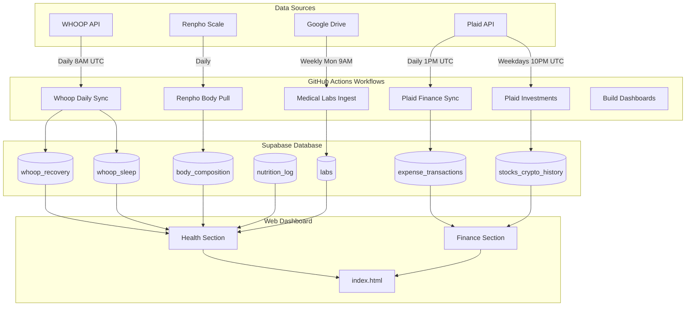
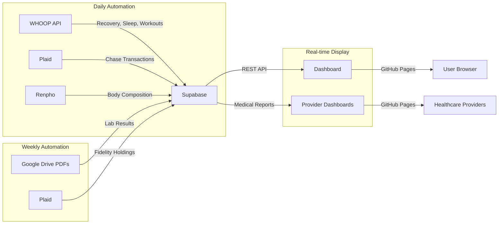

# Personal Dashboard & Automation

Unified personal dashboard and automation workflows for health, fitness, finances, and travel tracking.

**Live Dashboard:** https://fernandomartinez-de.github.io/personal/

---

## Architecture Overview



---

## Data Flow



---

## Project Structure

```
personal/
├── index.html                 # Main unified dashboard
├── manifest.json             # PWA configuration
├── assets/                   # Icons and images
│
├── finances/                 # Finance automation
│   ├── scripts/
│   │   ├── plaid_sync.py              # Daily Chase transaction sync
│   │   ├── plaid_investments_sync.py  # Daily Fidelity holdings
│   │   ├── plaid_link.py              # One-time Chase OAuth
│   │   └── plaid_investments_link.py  # One-time Fidelity OAuth
│   └── requirements.txt
│
├── health/                   # Health data automation
│   ├── whoop/
│   │   ├── sync.py           # Daily WHOOP data sync
│   │   └── bootstrap.py      # Weekly token refresh
│   ├── medical/
│   │   ├── ingest_labs_gdrive.py      # Weekly lab PDF ingestion
│   │   ├── build_dashboards.py        # Generate provider dashboards
│   │   └── clean_medical_drive.py     # Monthly drive cleanup
│   ├── fitness/
│   │   ├── build_overload.py          # Generate fitness dashboard
│   │   └── app.js                     # Fitness dashboard client
│   └── body/
│       └── renpho_pull.py             # Daily body composition sync
│
├── docs/                     # Document automation
│   ├── process_personal_inbox.py
│   └── scan_expirations.py
│
├── travel/                   # Trip planning
│   └── japan/
│
├── vault/                    # Obsidian personal vault
│   └── workflows/           # Automation documentation
│
└── .github/workflows/       # Automation workflows
    ├── whoop-daily-sync.yml
    ├── pull-finances.yml
    ├── pull-investments.yml
    ├── pull-body.yml
    ├── medical-ingest-labs.yml
    ├── medical-rebuild-dashboards.yml
    └── medical-clean-drive.yml
```

---

## Supabase Tables

### Health Tables

| Table | Grain | Purpose | Updated By |
|-------|-------|---------|------------|
| `whoop_recovery` | Daily | Recovery scores, HRV, resting HR | `whoop/sync.py` |
| `whoop_sleep` | Per session | Sleep stages, duration, quality | `whoop/sync.py` |
| `whoop_cycles` | Per cycle | Strain, heart rate, calories | `whoop/sync.py` |
| `whoop_workouts` | Per workout | Exercise tracking | `whoop/sync.py` |
| `body_composition` | Per measurement | Weight, body fat %, muscle mass | `body/renpho_pull.py` |
| `nutrition_log` | Per meal | Calories, macros | Manual entry |
| `labs` | Per test | Medical lab results | `medical/ingest_labs_gdrive.py` |

### Finance Tables

| Table | Grain | Purpose | Updated By |
|-------|-------|---------|------------|
| `expense_transactions` | Per transaction | Categorized expenses | `plaid_sync.py` |
| `stocks_crypto_history` | Daily snapshot | Investment holdings | `plaid_investments_sync.py` |
| `real_estate_history` | Monthly | Property valuations | Manual |
| `category_mapping` | Per rule | Expense categorization rules | Manual |

---

## Active Workflows

| Workflow | Schedule | Status | Purpose |
|----------|----------|--------|---------|
| Whoop Daily Sync | Daily 8 AM UTC | ✅ Active | Fetch fitness data from WHOOP API |
| Plaid Finance Sync | Daily 1 PM UTC | ✅ Active | Pull Chase transactions |
| Plaid Investments | Weekdays 10 PM UTC | ✅ Active | Pull Fidelity holdings |
| Medical Labs Ingest | Mon 9 AM UTC | ✅ Active | Extract lab results from PDFs |
| Medical Dashboards | Mon 10 AM UTC | ✅ Active | Rebuild provider dashboards |
| Renpho Body Sync | Daily | ✅ Active | Pull body composition data |
| Medical Drive Clean | 1st of month | ✅ Active | Organize Google Drive medical files |

---

## Setup

### Prerequisites

- **Supabase Account**: PostgreSQL database hosting
- **GitHub Secrets**: Configure in repo Settings → Secrets → Actions
- **API Keys**: WHOOP, Plaid, Google Drive, Anthropic (for medical)

### Required GitHub Secrets

```bash
# Supabase
SUPABASE_URL=https://your-project.supabase.co
SUPABASE_KEY=your-anon-key

# WHOOP
WHOOP_CLIENT_ID=your-client-id
WHOOP_CLIENT_SECRET=your-client-secret
WHOOP_REFRESH_TOKEN=your-refresh-token

# Plaid
PLAID_CLIENT_ID=your-client-id
PLAID_SECRET=your-secret
PLAID_ACCESS_TOKEN=your-chase-token
PLAID_ITEM_ID=your-chase-item-id
PLAID_FIDELITY_ACCESS_TOKEN=your-fidelity-token

# Google Drive
GOOGLE_CREDENTIALS=your-service-account-json

# Anthropic (for medical PDF parsing)
ANTHROPIC_API_KEY=your-api-key

# GitHub (for token refresh)
GH_PAT=your-personal-access-token
```

### Initial Setup

1. **Clone the repository:**
   ```bash
   git clone https://github.com/fernandomartinez-de/personal.git
   cd personal
   ```

2. **Set up Supabase tables:**
   - Run the SQL migrations in `vault/workflows/*/supabase-tables.md`

3. **Configure API connections:**
   
   **WHOOP:**
   ```bash
   cd health/whoop
   python bootstrap.py  # Follow OAuth flow
   ```

   **Plaid (Chase):**
   ```bash
   cd finances/scripts
   python plaid_link.py  # Follow OAuth flow
   ```

   **Plaid (Fidelity):**
   ```bash
   python plaid_investments_link.py  # Follow OAuth flow
   ```

4. **Add GitHub Secrets:**
   - Go to repo Settings → Secrets → Actions
   - Add all required secrets listed above

5. **Test workflows:**
   ```bash
   # Trigger manually from Actions tab
   Actions → Select workflow → Run workflow
   ```

---

## Dashboard Features

### Finance Section
- 💰 Real-time net worth tracking
- 📊 Monthly expense breakdown
- 💳 Automated Chase transaction categorization
- 📈 Fidelity investment portfolio tracking
- 🏠 Real estate valuation history

### Health Section
- ❤️ WHOOP recovery & HRV trends
- 😴 Sleep quality & stage analysis
- ⚖️ Body composition tracking (weight, body fat, muscle)
- 🍽️ Nutrition & macro tracking
- 📋 Medical lab results history

---

## Deployment

The dashboard is automatically deployed via **GitHub Pages** from the `main` branch root.

**Live URL:** https://fernandomartinez-de.github.io/personal/

**To deploy updates:**
```bash
git add index.html
git commit -m "Update dashboard"
git push origin main
# GitHub Pages automatically rebuilds in ~1 minute
```

---

## Medical Provider Dashboards

Separate dashboards auto-generated for healthcare providers:

- **Oncologist Dashboard**: Thyroglobulin trends, TSH, T4, PET scan history
- **Nutritionist Dashboard**: InBody data, WHOOP metrics, workout strain

**Live at:** https://fernandomartinez-de.github.io/vital-signal-reports/

**Generated by:** `health/medical/build_dashboards.py` (runs weekly)

---

## Development

### Testing Locally

**Dashboard:**
```bash
# Serve locally
python -m http.server 8000
# Open http://localhost:8000
```

**Python Scripts:**
```bash
# Set environment variables
export SUPABASE_URL=...
export SUPABASE_KEY=...

# Run scripts
python health/whoop/sync.py
python finances/scripts/plaid_sync.py
```

### Adding New Automation

1. Create Python script in appropriate folder
2. Add `requirements.txt` if needed
3. Create GitHub Actions workflow in `.github/workflows/`
4. Add required secrets to repo
5. Test with `workflow_dispatch` trigger
6. Document in `vault/workflows/`

---

## Documentation

Comprehensive workflow documentation lives in the **Obsidian vault**:

- `vault/workflows/health/` - Health automation details
- `vault/workflows/finances/` - Finance automation details
- `vault/workflows/README.md` - Complete workflow index

---

## Tech Stack

- **Frontend**: Vanilla JavaScript, HTML5, CSS3
- **Charts**: Chart.js
- **Database**: Supabase (PostgreSQL)
- **Automation**: GitHub Actions
- **APIs**: WHOOP, Plaid, Google Drive, Anthropic
- **Deployment**: GitHub Pages
- **Documentation**: Obsidian

---

## License

Personal use only.

---

## Contact

Fernando Martinez
- GitHub: [@fernandomartinez-de](https://github.com/fernandomartinez-de)
