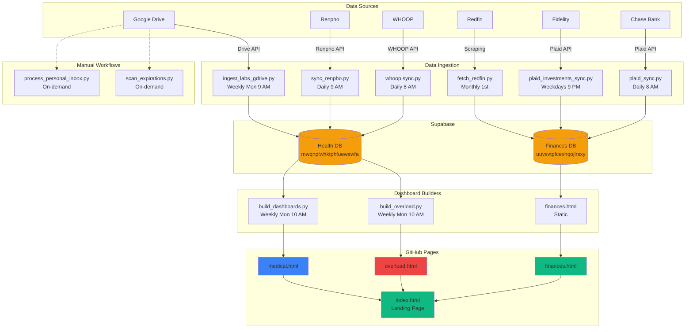

# Personal Dashboard & Automation

Consolidated personal dashboard and automation repository deployed at **https://fernandomartinez-de.github.io/personal/**

## Overview

Unified landing page with three main dashboards:
- **💰 Finances** - Net worth tracking, expense analysis, investment portfolio
- **💪 Fitness** - Training plans, WHOOP data, nutrition tracking (Overload)
- **🏥 Medical** - Oncologist and nutritionist lab dashboards

All dashboards update automatically via GitHub Actions workflows and deploy to GitHub Pages.

## Live Dashboards

**Landing Page:** https://fernandomartinez-de.github.io/personal/

**Direct Links:**
- Finances: https://fernandomartinez-de.github.io/personal/finances/finances.html
- Fitness (Overload): https://fernandomartinez-de.github.io/personal/health/fitness/overload.html
- Medical: https://fernandomartinez-de.github.io/personal/health/medical/medical.html

## Repository Structure

```
personal/
├── index.html                    # Landing page with 3 dashboard cards
├── manifest.json                 # PWA manifest
├── sw.js                         # Service worker
├── assets/                       # Icons and static assets
│
├── finances/                     # Finance Dashboard
│   ├── finances.html             # Dashboard page
│   ├── scripts/
│   │   ├── plaid_link.py         # One-time: Connect Chase via Plaid
│   │   ├── plaid_sync.py         # Daily: Pull Chase transactions
│   │   ├── plaid_investments_link.py    # One-time: Connect Fidelity
│   │   ├── plaid_investments_sync.py    # Daily: Pull investment holdings
│   │   ├── fetch_redfin_property_value.py  # Monthly: Property values
│   │   ├── load_bronze.py        # Process raw data
│   │   └── process_finances_inbox.py  # Manual statement processing
│   └── requirements.txt
│
├── health/
│   ├── fitness/                  # Fitness Dashboard (Overload)
│   │   ├── overload.html         # Main dashboard
│   │   ├── build_overload.py     # Build script (runs weekly)
│   │   ├── template.html         # Dashboard template
│   │   └── requirements.txt
│   │
│   ├── medical/                  # Medical Dashboard
│   │   ├── medical.html          # Wrapper with tabs (Oncologist/Nutritionist)
│   │   ├── martinez_oncologist_dashboard.html    # Auto-generated weekly
│   │   ├── martinez_nutritionist_dashboard.html  # Auto-generated weekly
│   │   ├── build_dashboards.py   # Dashboard generator
│   │   ├── ingest_labs_gdrive.py # Google Drive lab PDF ingestion
│   │   ├── clean_medical_drive.py # Monthly Drive cleanup
│   │   └── requirements.txt
│   │
│   ├── whoop/                    # WHOOP Data Sync
│   │   ├── sync.py               # Daily sync to Supabase
│   │   ├── bootstrap.py          # Token refresh
│   │   └── requirements.txt
│   │
│   └── body/                     # Body Composition
│       ├── sync_renpho.py        # Daily Renpho sync
│       └── requirements.txt
│
├── docs/                         # Document Automation
│   ├── process_personal_inbox.py
│   ├── scan_expirations.py
│   ├── PROCESS_INBOX.bat
│   └── SCAN_EXPIRATIONS.bat
│
├── travel/                       # Trip Planning
│   ├── index.html
│   └── japan/
│
└── vault/                        # Obsidian Vault (gitignored)
    ├── workflows/                # Workflow documentation
    ├── ops/                      # Operational notes
    └── outputs/                  # Processing logs
```

## Data Sources

### Supabase (Primary Database)
**Finances Project:** `uuvsvtpfcexhqojlrsxy.supabase.co`
- expense_transactions
- stocks_crypto_history
- real_estate_history
- category_mapping

**Medical/Health Project:** `mwqnplwhktphfuewswfa.supabase.co`
- whoop_recovery, whoop_cycles, whoop_sleep, whoop_workouts
- body_composition
- nutrition_log
- strength_sessions, strength_exercises, strength_sets
- labs

### External APIs
- **Plaid** - Chase transactions (daily) + Fidelity investments (daily weekdays)
- **WHOOP** - Fitness & recovery data (daily)
- **Renpho** - Body composition (daily)
- **Redfin** - Property values (monthly)

### Google Drive
- Medical PDFs → Auto-ingested weekly
- Personal documents → Manual filing
- Financial statements → Manual backfill

## Automated Workflows (GitHub Actions)

| Workflow | Schedule | Purpose | Status |
|----------|----------|---------|--------|
| `pull-finances.yml` | Daily 8 AM UTC | Chase transactions via Plaid | ✅ Active |
| `pull-investments.yml` | Weekdays 9 PM UTC | Fidelity holdings via Plaid | ⏳ Pending Investments product approval |
| `pull-body.yml` | Daily 9 AM UTC | Renpho body composition | ✅ Active |
| `build-fitness.yml` | Weekly Mon 10 AM UTC | Rebuild Overload dashboard | ✅ Active |
| `whoop-daily-sync.yml` | Daily 8 AM UTC | WHOOP data sync | ✅ Active |
| `whoop-bootstrap-token.yml` | Weekly Sun midnight | WHOOP token refresh | ✅ Active |
| `medical-ingest-labs.yml` | Weekly Mon 9 AM UTC | Ingest lab PDFs from Drive | ✅ Active |
| `medical-rebuild-dashboards.yml` | Weekly Mon 10 AM UTC | Rebuild medical dashboards | ✅ Active |
| `medical-clean-drive.yml` | Monthly 1st midnight | Clean up medical Drive files | ✅ Active |
| `redfin-property-sync.yml` | Monthly 1st 1 AM UTC | Update property values | ✅ Active |

## Quick Start

### One-Time Setup

#### 1. Connect Chase via Plaid
```powershell
cd finances
python scripts\plaid_link.py
```
Opens Plaid Hosted Link → Connect Chase → Exchange token → Save to `.plaid_secrets.local`
Add `PLAID_ACCESS_TOKEN` to GitHub Secrets.

#### 2. Connect Fidelity via Plaid (Investments)
**Prerequisites:**
- Plaid Investments product enabled (request at dashboard.plaid.com)
- Fidelity OAuth access enabled (automated approval)

```powershell
cd finances
python scripts\plaid_investments_link.py
```
Opens Plaid Hosted Link → Connect Fidelity → Select accounts → Save tokens
Add `PLAID_FIDELITY_ACCESS_TOKEN` and `PLAID_FIDELITY_ITEM_ID` to GitHub Secrets.

#### 3. Bootstrap WHOOP Token
```powershell
cd health\whoop
python bootstrap.py
```
Opens WHOOP OAuth → Authorize → Save refresh token
Add `WHOOP_REFRESH_TOKEN` to GitHub Secrets.

#### 4. Configure Google Drive
Create service account at https://console.cloud.google.com/
Download JSON credentials → Add as GitHub Secret `GOOGLE_CREDENTIALS`
Share Google Drive folders with service account email.

### Local Development

#### Build Fitness Dashboard
```powershell
$env:SUPABASE_URL="https://mwqnplwhktphfuewswfa.supabase.co"
$env:SUPABASE_KEY="<key>"
cd health\fitness
pip install -r requirements.txt
python build_overload.py
```
Outputs: `overload.html`

#### Build Medical Dashboards
```powershell
cd health\medical
pip install -r requirements.txt
python build_dashboards.py
```
Outputs: `martinez_oncologist_dashboard.html`, `martinez_nutritionist_dashboard.html`

#### Manual Finance Sync
```powershell
cd finances
python scripts\plaid_sync.py
```

## Manual Workflows

### Process Personal Documents
```powershell
cd docs
# Double-click PROCESS_INBOX.bat or:
python process_personal_inbox.py
```
Drop documents in `vault/inbox/personal-docs/` → Auto-files to Google Drive with standard naming

### Scan Document Expirations
```powershell
cd docs
# Double-click SCAN_EXPIRATIONS.bat or:
python scan_expirations.py
```

### Manual Finance Statement Filing
```powershell
cd finances
python scripts\process_finances_inbox.py
```
Drop Excel statements in `vault/inbox/finances/` → Processes into Supabase

## GitHub Pages Deployment

**Automatic deployment on push to `main`**

The landing page (`index.html`) and all dashboards deploy automatically when changes are pushed.

**Cache Busting:**
After deployment, hard refresh: `Ctrl + Shift + R`

**Service Worker:**
PWA caches: index.html, manifest.json, icons
Cache version: `personal-v2` (bump to invalidate)

## GitHub Secrets

Required secrets in **Settings → Secrets → Actions**:

### Plaid
- `PLAID_CLIENT_ID`
- `PLAID_SECRET`
- `PLAID_ACCESS_TOKEN` (Chase)
- `PLAID_FIDELITY_ACCESS_TOKEN` (Fidelity investments)
- `PLAID_FIDELITY_ITEM_ID`

### Supabase
- `SUPABASE_URL` (finances project)
- `SUPABASE_KEY`
- `SUPABASE_URL_HEALTH` (medical/health project)
- `SUPABASE_KEY_HEALTH`

### WHOOP
- `WHOOP_CLIENT_ID`
- `WHOOP_CLIENT_SECRET`
- `WHOOP_REFRESH_TOKEN` (auto-updated weekly)

### Google
- `GOOGLE_CREDENTIALS` (service account JSON)

### GitHub
- `GH_PAT` (for updating WHOOP refresh token)

## Tech Stack

- **Frontend:** HTML, CSS, JavaScript, Chart.js
- **Backend:** Python (automation scripts)
- **Database:** Supabase (PostgreSQL)
- **APIs:** Plaid, WHOOP, Renpho, Redfin
- **Storage:** Google Drive
- **CI/CD:** GitHub Actions
- **Deployment:** GitHub Pages
- **Notes:** Obsidian (vault)

## Workflow Diagram



## Standard Naming Convention

All automated files follow: `YYYY-MM-DD_category_source_description.ext`

**Examples:**
- `2026-09-25_labs_quest_comprehensive-metabolic.pdf`
- `2026-04-15_passport_usa.pdf`
- `2025-01-31_w2_prestige.pdf`
- `2026-09-13_expense_chase-checking.xlsx`

## Maintenance

### Daily (Automated)
- Chase transaction sync
- Fidelity investment sync (weekdays)
- WHOOP data sync
- Renpho body composition sync

### Weekly (Automated)
- WHOOP token refresh (Sunday midnight)
- Medical lab PDF ingestion (Monday 9 AM)
- Medical & fitness dashboard rebuilds (Monday 10 AM)

### Monthly (Automated)
- Property value sync (1st, 1 AM)
- Medical Drive cleanup (1st, midnight)

### Monthly (Manual)
- Process personal documents inbox
- Scan document expirations
- Review dashboards for accuracy

## Troubleshooting

### Dashboard Not Updating
1. Check GitHub Actions tab for workflow failures
2. Verify secrets are current
3. Check Supabase for data issues
4. Hard refresh browser: `Ctrl + Shift + R`

### Plaid Connection Issues
```powershell
# Re-link Chase
cd finances
python scripts\plaid_link.py

# Re-link Fidelity
python scripts\plaid_investments_link.py
```

### WHOOP Token Expired
```powershell
cd health\whoop
python bootstrap.py
```

### Medical Dashboards Empty
1. Check Google Drive for PDFs in Medical/ folder
2. Run manual ingestion:
```powershell
cd health\medical
python ingest_labs_gdrive.py
python build_dashboards.py
```

## Related Projects

**Kept Separate:**
- `21st-mcp/` - MCP server development
- `corporate-sales-analytics/` - SS&C work vault

## Git Workflow

```powershell
cd C:\Users\fmartine\Personal\repos\personal
git add .
git commit -m "Description of changes"
git push
```

GitHub Pages deploys automatically on push to `main`.

## Links

- 🌐 [Live Dashboards](https://fernandomartinez-de.github.io/personal/)
- 🐙 [GitHub Repository](https://github.com/fernandomartinez-de/personal)
- 📊 [Supabase Finances](https://supabase.com/dashboard/project/uuvsvtpfcexhqojlrsxy)
- 📊 [Supabase Health](https://supabase.com/dashboard/project/mwqnplwhktphfuewswfa)
- 🔑 [GitHub Secrets](https://github.com/fernandomartinez-de/personal/settings/secrets/actions)
- 📋 [Plaid Dashboard](https://dashboard.plaid.com/)
- 💾 [Google Drive](https://drive.google.com/drive/my-drive)
