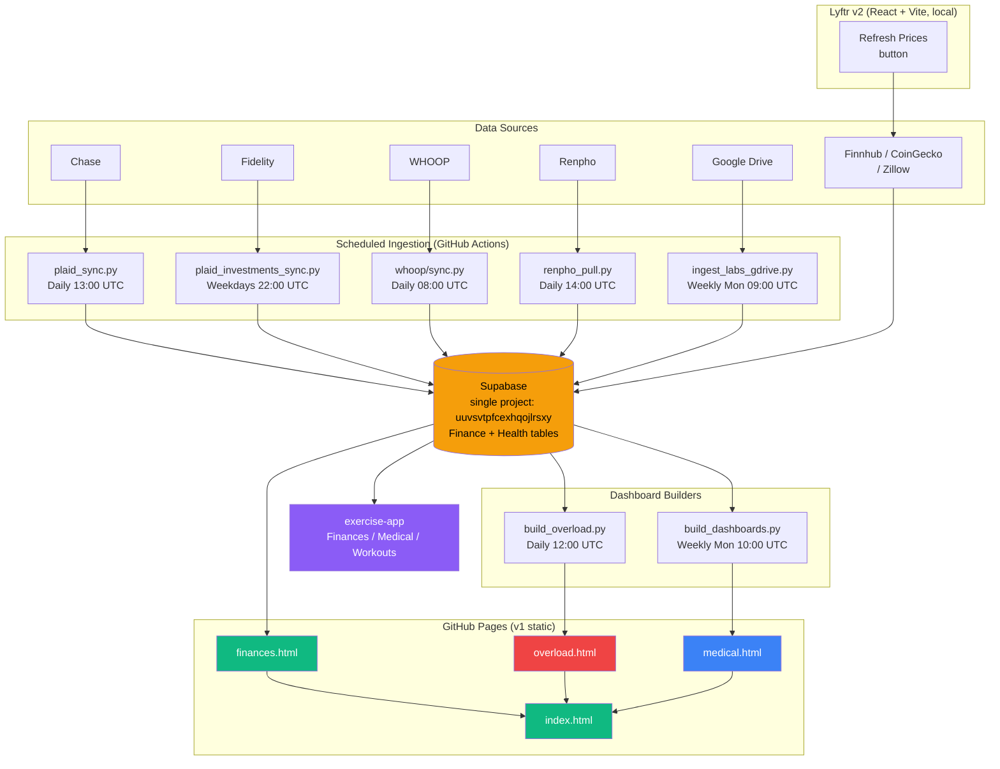

# Personal Dashboard & Automation

Consolidated personal dashboard and automation repository deployed at **https://fernandomartinez-de.github.io/personal/**

## Overview

Unified landing page with three areas:
- **Finances** Net worth, expenses, and investment portfolio
- **Fitness** Training, WHOOP data, body composition (Overload v1 + Lyftr v2)
- **Medical** Oncologist and nutritionist lab dashboards

Data is pulled into a single Supabase project by scheduled GitHub Actions. The static dashboards deploy to GitHub Pages.

> **Security note:** This repository is **public**. Keep credentials out of it. API keys and tokens live in GitHub Secrets and in gitignored local files (`.env`, `.plaid_secrets.local`, `.plaid_investments_secrets.local`), never in committed code.

## Live Dashboards

**Landing Page:** https://fernandomartinez-de.github.io/personal/

**Direct Links:**
- Finances (v1): https://fernandomartinez-de.github.io/personal/finances/finances.html
- Fitness (Overload v1): https://fernandomartinez-de.github.io/personal/health/fitness/overload.html
- Medical: https://fernandomartinez-de.github.io/personal/health/medical/medical.html

The v2 "Lyftr" app (`health/fitness/exercise-app/`) is a React + Vite SPA run locally with `npm run dev`. It is not currently built or deployed by a GitHub Action.

## Repository Structure

```
personal/
├── index.html                      # v1 landing page (dashboard cards)
├── manifest.json                   # PWA manifest
├── sw.js                           # Service worker
├── assets/                         # Icons (apple-touch, 192, 512)
│
├── finances/                       # Finances (v1 dashboard + Plaid pipeline)
│   ├── finances.html               # v1 standalone finances dashboard
│   ├── .env.example
│   ├── requirements.txt
│   └── scripts/
│       ├── plaid_link.py                  # One-time: link Chase (Hosted Link)
│       ├── plaid_sync.py                  # Daily: Chase txns -> expense_transactions
│       ├── plaid_investments_link.py      # One-time: link Fidelity (Investments)
│       ├── plaid_investments_sync.py      # Weekdays: Fidelity holdings -> stocks_crypto_history
│       ├── fetch_zillow_property_value.py # Manual: Zillow Zestimate -> real_estate_history
│       └── serve_dashboard.py             # Local static server for finances.html
│
├── health/
│   ├── fitness/
│   │   ├── overload.html           # v1 Overload dashboard (deployed)
│   │   ├── app.js                  # v1 Overload client logic
│   │   ├── requirements.txt
│   │   ├── Scripts/
│   │   │   ├── build_overload.py   # Renders overload.html from Supabase
│   │   │   └── suggestions.py      # Training suggestions (imported by build)
│   │   └── exercise-app/           # v2 "Lyftr" React + Vite SPA
│   │       ├── src/                # pages/, components/, utils/
│   │       ├── public/medical/     # provider dashboards bundled for the app
│   │       ├── supabase/           # create_workouts.sql, create_workout_logs.sql
│   │       ├── index.html, package.json, vite.config.js
│   │       └── .env.example
│   │
│   ├── medical/
│   │   ├── medical.html            # Wrapper with Oncologist/Nutritionist tabs
│   │   ├── martinez_oncologist_dashboard.html    # Auto-generated
│   │   ├── martinez_nutritionist_dashboard.html  # Auto-generated
│   │   ├── build_dashboards.py     # Dashboard generator
│   │   ├── ingest_labs_gdrive.py   # Ingest lab PDFs from Google Drive
│   │   ├── clean_medical_drive.py  # Monthly Drive cleanup
│   │   └── requirements.txt
│   │
│   ├── whoop/
│   │   ├── sync.py                 # Daily WHOOP -> Supabase
│   │   ├── bootstrap.py            # One-time OAuth bootstrap
│   │   └── requirements.txt
│   │
│   └── body/
│       ├── renpho_pull.py          # Daily Renpho -> body_composition
│       └── requirements.txt
│
├── docs/                           # Document expiration scanner
│   ├── scan_expirations.py
│   ├── SCAN_EXPIRATIONS.bat
│   └── requirements.txt
│
└── vault/                          # Obsidian vault (personal notes)
    ├── workflows/                  # Workflow documentation
    ├── life-admin/ identity/ family/ quick-ref/ ops/
    └── ...
```

## v2 App (Lyftr)

`health/fitness/exercise-app/` is the second-generation app: React 18, Vite 5, react-router, vanilla JS plus Chart.js style visuals, Supabase JS anon client, and React Bits animation components.

**Pages:** Home, Hub, Exercises (list + detail), Workouts (list + detail), Programs, Weight, Food, Finances (Expenses + Investments tabs), Medical (Oncologist + Nutritionist views).

**Notable features:**
- Finances → Investments has a manual **Refresh Prices** button that writes a fresh snapshot to `stocks_crypto_history` (Finnhub stocks, CoinGecko crypto, Zillow via RapidAPI for property).
- Medical page embeds the same provider dashboards as the v1 medical wrapper.
- Reads/writes Supabase via the anon client using `VITE_*` env vars from `.env.local` (gitignored).

**Run locally:**
```powershell
cd health\fitness\exercise-app
npm install
npm run dev        # Vite dev server on http://localhost:5173
```

## Data Sources

### Supabase (single project)

All finance and health data lives in one Supabase project: **`uuvsvtpfcexhqojlrsxy`** ("Personal"). Every workflow uses the same `SUPABASE_URL` / `SUPABASE_KEY` pair. There is no separate health project.

**Finance tables:** `expense_transactions`, `category_mapping`, `stocks_crypto_history`, `real_estate_history`, `plaid_accounts`, `plaid_sync_state`

**Health tables:** `whoop_recovery`, `whoop_cycles`, `whoop_sleep`, `whoop_workouts`, `whoop_body`, `lab_results`, `body_composition`, `inbody_results`, `nutrition_log`, `strength_sessions`, `strength_exercises`, `strength_sets`, `training_plan`, `meal_plan`, `meal_templates`, `running_log`

**v2 app tables:** `exercises`, `workouts`, `workout_exercises`, `completed_workouts`, `completed_workout_exercises`

**Config:** `app_config`

### External APIs
- **Plaid** Chase transactions (daily) and Fidelity investment holdings (weekdays)
- **WHOOP** Recovery, sleep, workouts, cycles (daily)
- **Renpho** Body composition (daily)
- **Finnhub / CoinGecko / Zillow (RapidAPI)** Live stock, crypto, and property values (on demand via the dashboard Refresh Prices button; Zillow also available as a manual script)
- **Google Drive** Medical lab PDFs (ingested weekly)

## Automated Workflows (GitHub Actions)

Eight workflows. All times are UTC (New York is UTC minus 4 during EDT).

| Workflow | Schedule | Runs | Purpose | Status |
|----------|----------|------|---------|--------|
| `pull-finances.yml` | Daily 13:00 (`0 13 * * *`) | `finances/scripts/plaid_sync.py` | Chase transactions via Plaid | Active |
| `pull-investments.yml` | Weekdays 22:00 (`0 22 * * 1-5`) | `finances/scripts/plaid_investments_sync.py` | Fidelity holdings via Plaid | Active (live since 2026-09-27) |
| `pull-body.yml` | Daily 14:00 (`0 14 * * *`) | `health/body/renpho_pull.py` | Renpho body composition | Active |
| `whoop-daily-sync.yml` | Daily 08:00 (`0 8 * * *`) | `health/whoop/sync.py` | WHOOP data sync | Active |
| `build-fitness.yml` | Daily 12:00 (`0 12 * * *`) | `health/fitness/build_overload.py` | Rebuild Overload dashboard | Needs repair (see Known Issues) |
| `medical-ingest-labs.yml` | Weekly Mon 09:00 (`0 9 * * 1`) | `health/medical/ingest_labs_gdrive.py` | Ingest lab PDFs from Drive | Active |
| `medical-rebuild-dashboards.yml` | Weekly Mon 10:00 (`0 10 * * 1`) | `health/medical/build_dashboards.py` | Rebuild medical dashboards | Active |
| `medical-clean-drive.yml` | Monthly 1st 00:00 (`0 0 1 * *`) | `health/medical/clean_medical_drive.py` | Clean medical Drive files | Active |

WHOOP token refresh is handled inside `whoop-daily-sync.yml` (it writes a fresh `WHOOP_REFRESH_TOKEN` using `GH_PAT`); there is no separate token workflow. Property values are refreshed on demand from the dashboard, so there is no scheduled property workflow.

## Quick Start

### One-Time Setup

**1. Connect Chase via Plaid**
```powershell
cd finances\scripts
python plaid_link.py
```
Opens Plaid Hosted Link, connects Chase, exchanges the token, and writes it to `.plaid_secrets.local` (gitignored). Add `PLAID_ACCESS_TOKEN` and `PLAID_ITEM_ID` to GitHub Secrets.

**2. Connect Fidelity via Plaid (Investments)**
```powershell
cd finances\scripts
python plaid_investments_link.py
```
Requires the Plaid Investments product and Fidelity OAuth enabled. Writes `PLAID_FIDELITY_ACCESS_TOKEN` and `PLAID_FIDELITY_ITEM_ID` to `.plaid_investments_secrets.local` (gitignored). Add `PLAID_FIDELITY_ACCESS_TOKEN` to GitHub Secrets.

**3. Bootstrap WHOOP token**
```powershell
cd health\whoop
python bootstrap.py
```
Add `WHOOP_REFRESH_TOKEN` to GitHub Secrets (thereafter auto refreshed by the daily workflow).

**4. Google Drive service account**
Create a service account, download the JSON, and add it as the `GOOGLE_CREDENTIALS` secret. Share the medical Drive folders with the service account email.

### Local Development

**Build the Overload (v1) dashboard**
```powershell
$env:SUPABASE_URL="https://uuvsvtpfcexhqojlrsxy.supabase.co"
$env:SUPABASE_KEY="<anon key>"
pip install -r health\fitness\requirements.txt
python health\fitness\Scripts\build_overload.py
```

**Build the medical dashboards**
```powershell
$env:SUPABASE_URL="https://uuvsvtpfcexhqojlrsxy.supabase.co"
$env:SUPABASE_KEY="<anon key>"
pip install -r health\medical\requirements.txt
cd health\medical
python build_dashboards.py
```

**Manual Chase sync**
```powershell
cd finances\scripts
python plaid_sync.py
```

**Manual property value (Zillow)**
```powershell
cd finances\scripts
python fetch_zillow_property_value.py
```

## GitHub Pages Deployment

The landing page (`index.html`) and the static dashboards deploy automatically on push to `main`. After a deploy, hard refresh with `Ctrl + Shift + R`. The service worker caches `index.html`, `manifest.json`, and icons; bump the cache version in `sw.js` to invalidate.

## GitHub Secrets

Configured in **Settings → Secrets and variables → Actions**:

**Supabase**
- `SUPABASE_URL`
- `SUPABASE_KEY`

**Plaid**
- `PLAID_CLIENT_ID`
- `PLAID_SECRET`
- `PLAID_ACCESS_TOKEN` (Chase)
- `PLAID_ITEM_ID` (Chase)
- `PLAID_FIDELITY_ACCESS_TOKEN` (Fidelity)

**WHOOP**
- `WHOOP_CLIENT_ID`
- `WHOOP_CLIENT_SECRET`
- `WHOOP_REFRESH_TOKEN` (auto updated daily)

**Renpho**
- `RENPHO_EMAIL`
- `RENPHO_PASSWORD`

**Google / Anthropic / GitHub**
- `GOOGLE_CREDENTIALS` (service account JSON, medical ingest and clean)
- `ANTHROPIC_API_KEY` (medical ingest and clean)
- `GH_PAT` (whoop workflow, to update the refresh token)

## Tech Stack

- **v1 Frontend:** HTML, CSS, vanilla JS, Chart.js
- **v2 Frontend:** React 18, Vite 5, react-router, Chart.js, React Bits, Supabase JS
- **Backend:** Python automation scripts
- **Database:** Supabase (PostgreSQL), single project
- **APIs:** Plaid, WHOOP, Renpho, Finnhub, CoinGecko, Zillow (RapidAPI)
- **Storage:** Google Drive (medical PDFs)
- **CI/CD:** GitHub Actions
- **Deployment:** GitHub Pages (v1 static assets)
- **Notes:** Obsidian (vault)

## Architecture Diagram


```mermaid
graph TB
    subgraph DS["Data Sources"]
        PRICES[Finnhub / CoinGecko<br/>/ Zillow]
        CHASE[Chase]
        FIDELITY[Fidelity]
        WHOOP[WHOOP]
        RENPHO[Renpho]
        GDRIVE[Google Drive]
    end

    subgraph LYFTR["Lyftr v2 (React + Vite, local)"]
        REFRESH[Refresh Prices<br/>button]
    end

    subgraph GHA["Scheduled Ingestion (GitHub Actions)"]
        PLAID_CHASE[plaid_sync.py<br/>Daily 13:00 UTC]
        PLAID_INV[plaid_investments_sync.py<br/>Weekdays 22:00 UTC]
        WHOOP_SYNC[whoop/sync.py<br/>Daily 08:00 UTC]
        BODY_SYNC[renpho_pull.py<br/>Daily 14:00 UTC]
        LABS_INGEST[ingest_labs_gdrive.py<br/>Weekly Mon 09:00 UTC]
    end

    SUPA[(Supabase<br/>single project: uuvsvtpfcexhqojlrsxy<br/>Finance + Health tables)]

    subgraph BUILD["Dashboard Builders"]
        BUILD_FITNESS[build_overload.py<br/>Daily 12:00 UTC]
        BUILD_MEDICAL[build_dashboards.py<br/>Weekly Mon 10:00 UTC]
    end

    subgraph GHP["GitHub Pages (v1 static)"]
        DASH_FINANCE[finances.html]
        DASH_FITNESS[overload.html]
        DASH_MEDICAL[medical.html]
        LANDING[index.html]
    end

    LYFTR_APP[exercise-app<br/>Finances / Medical / Workouts]

    CHASE --> PLAID_CHASE
    FIDELITY --> PLAID_INV
    WHOOP --> WHOOP_SYNC
    RENPHO --> BODY_SYNC
    GDRIVE --> LABS_INGEST

    PLAID_CHASE --> SUPA
    PLAID_INV --> SUPA
    WHOOP_SYNC --> SUPA
    BODY_SYNC --> SUPA
    LABS_INGEST --> SUPA

    SUPA --> LYFTR_APP
    SUPA --> DASH_FINANCE
    SUPA --> BUILD_FITNESS
    SUPA --> BUILD_MEDICAL

    BUILD_FITNESS --> DASH_FITNESS
    BUILD_MEDICAL --> DASH_MEDICAL

    DASH_FINANCE --> LANDING
    DASH_FITNESS --> LANDING
    DASH_MEDICAL --> LANDING

    REFRESH --> PRICES
    PRICES --> SUPA

    style LANDING fill:#10b981,color:#fff
    style DASH_FINANCE fill:#10b981,color:#fff
    style DASH_FITNESS fill:#ef4444,color:#fff
    style DASH_MEDICAL fill:#3b82f6,color:#fff
    style SUPA fill:#f59e0b,color:#000
    style LYFTR_APP fill:#8b5cf6,color:#fff
```

## Known Issues

- **`build-fitness.yml` needs repair.** The workflow runs `python health/fitness/build_overload.py`, but the script now lives at `health/fitness/Scripts/build_overload.py`, depends on a `template.html` that is not present in the repo, and writes `overload.html` beside the script rather than the deployed `health/fitness/overload.html`. The workflow also commits `health/fitness/index.html`, which does not exist. This build cannot succeed as written and should be reconciled (fix paths, restore `template.html`, and commit the correct output file).

## Maintenance

**Daily (automated):** Chase transactions, WHOOP, Renpho body composition, Overload rebuild.
**Weekdays (automated):** Fidelity investment holdings.
**Weekly (automated):** Lab PDF ingestion (Mon 09:00) and medical dashboard rebuild (Mon 10:00).
**Monthly (automated):** Medical Drive cleanup (1st).
**On demand:** Property values and live stock/crypto prices via the dashboard Refresh Prices button.

## Troubleshooting

**Dashboard not updating:** Check the Actions tab for failures, confirm secrets are current, verify Supabase has data, then hard refresh.
**Plaid connection issues:** Re-run `plaid_link.py` (Chase) or `plaid_investments_link.py` (Fidelity).
**WHOOP token expired:** Re-run `health/whoop/bootstrap.py`.
**Medical dashboards empty:** Confirm PDFs are in the Drive medical folder, then run `ingest_labs_gdrive.py` and `build_dashboards.py`.

## Links

- Live dashboards: https://fernandomartinez-de.github.io/personal/
- GitHub repository: https://github.com/fernandomartinez-de/personal
- Supabase project: https://supabase.com/dashboard/project/uuvsvtpfcexhqojlrsxy
- GitHub Secrets: https://github.com/fernandomartinez-de/personal/settings/secrets/actions
- Plaid dashboard: https://dashboard.plaid.com/
