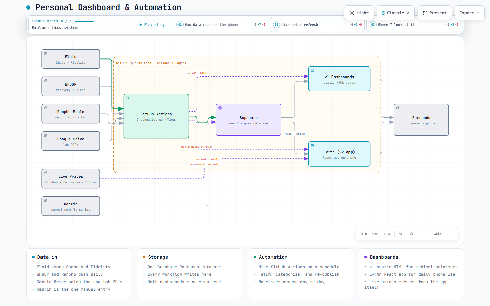
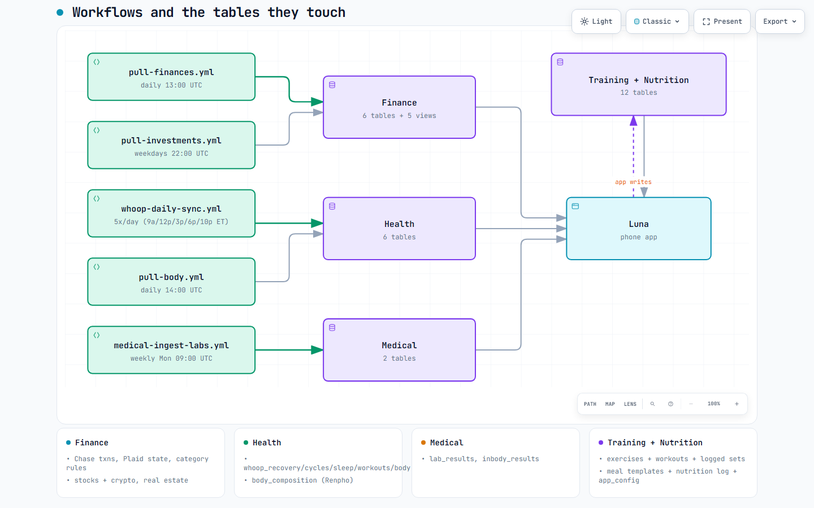

# Personal Dashboard & Automation

One phone app for my money, my body, and my health. Every number I care about, updated automatically every day.

**Live site:** https://fernandomartinez-de.github.io/personal/luna/

---

## What this is

Five services (Chase, Fidelity, WHOOP, Renpho, my medical Google Drive) push their data on a schedule into one Supabase database. **Luna** — a React app installed on the iPhone home screen — reads it all back and shows me what's changed.

No manual clicks, no juggling logins. When I open the app in the morning, last night's sleep, this month's spending, and yesterday's lab result are already there.

---

## System diagram

[](docs/assets/architecture.html)

*Click for the interactive version — pan, zoom, dark/light, guided views.*

---

## Workflows and tables

[](docs/assets/workflows-tables.html)

Five scheduled workflows fill four table groups. Luna reads them all. Luna also writes back to the training + nutrition tables when I log a workout or a meal.

### Automated workflows

| Workflow | Schedule (UTC) | What it does |
|----------|----------------|--------------|
| `pull-finances.yml` | Daily 13:00 | Chase transactions via Plaid → `expense_transactions` |
| `pull-investments.yml` | Weekdays 22:00 | Fidelity holdings via Plaid → `stocks_crypto_history` |
| `whoop-daily-sync.yml` | 5x/day (02, 13, 16, 19, 22 UTC ≈ ET 9a/12p/3p/6p/10p) | WHOOP wearable → `whoop_*` |
| `pull-body.yml` | Daily 14:00 | Renpho scale → `body_composition` |
| `medical-ingest-labs.yml` | Weekly Mon 09:00 | Google Drive lab PDFs → `lab_results`, `inbody_results` (Anthropic LLM extraction) |
| `medical-clean-drive.yml` | Monthly | Renames Drive PDFs into a canonical layout; no Supabase writes |
| `build-luna-v2.yml` | On push to `luna/app/**` | Rebuilds the React app and commits the built site to `luna/` |

### Supabase tables

One project, `uuvsvtpfcexhqojlrsxy`. Full column-level detail in [docs/tables.md](docs/tables.md).

**Finance** — `expense_transactions`, `plaid_accounts`, `plaid_sync_state`, `category_mapping`, `stocks_crypto_history`, `real_estate_history`
+ views: `vw_category_groups`, `vw_category_mapping`, `vw_dashboard_summary`, `vw_discretionary_summary`, `vw_fixed_costs_summary`

**Health (WHOOP + body)** — `whoop_recovery`, `whoop_cycles`, `whoop_sleep`, `whoop_workouts`, `whoop_body`, `body_composition`

**Medical** — `lab_results`, `inbody_results`

**Nutrition** — `nutrition_log`, `meal_templates`, `meal_plan`

**Training** — `exercises`, `workouts`, `workout_exercises`, `completed_workouts`, `completed_workout_exercises`, `strength_sessions`, `strength_exercises`, `strength_sets`, `strength_ingest_log`, `training_plan`, `running_log`

**Config** — `app_config`

Every table has RLS on. Backend workflows use `SUPABASE_SERVICE_ROLE_KEY` (bypasses RLS). Luna uses `SUPABASE_KEY` (anon) and can only write to a small set of app tables. See [docs/tables.md](docs/tables.md#row-level-security).

---

## Where to look for depth

| Folder | What's there |
|--------|--------------|
| [luna/](luna/README.md) | The React app — source in `luna/app/`, built site alongside it |
| [finances/](finances/README.md) | Plaid syncs (Chase + Fidelity), Zillow fallback, real estate |
| [health/](health/README.md) | WHOOP, Renpho, medical labs — three independent pipelines |
| [docs/](docs/README.md) | Documentation index, tables reference, maintainer notes |

---

## Install on your phone

Open https://fernandomartinez-de.github.io/personal/luna/ in Safari → Share → **Add to Home Screen**. The app installs with the Luna icon and behaves like a native app after that.

Same on Android via Chrome menu → **Add to Home Screen**.

---

## Is it safe?

The repo is public. Nothing sensitive is in it:

- Passwords and API keys live in **GitHub Secrets** (not the code).
- The Supabase anon key that ships with the app is read-mostly; **row-level security** blocks writes on every table except the ones the app is supposed to write to.
- No client work or company data here — this is my personal setup.

---

## Repo layout

```
personal/
├── index.html              # Redirects / to /luna/
├── 404.html                # SPA fallback for Luna
├── luna/                   # v2 app — source in luna/app/, built site alongside
├── finances/               # Plaid + Zillow scripts
├── health/                 # WHOOP + Renpho + medical labs
├── docs/                   # Documentation + diagrams
└── vault/                  # Personal Obsidian notes
```
