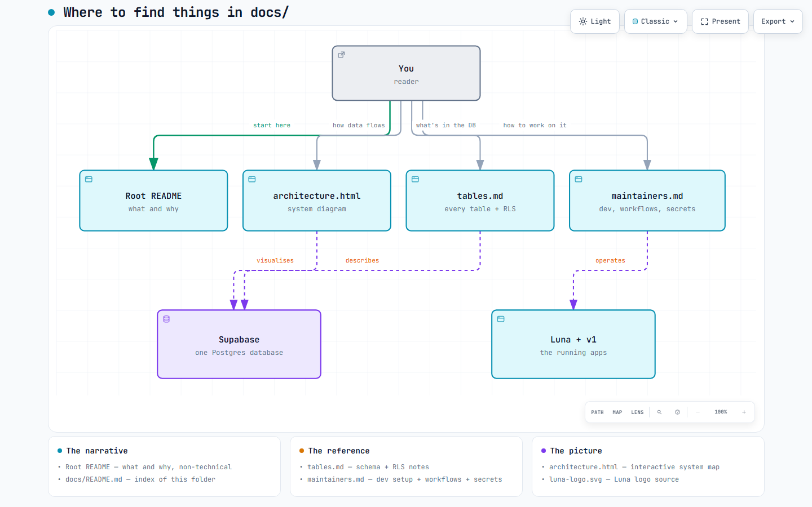

# docs

Everything that explains the repo. If you're looking for the site itself, go to [the root README](../README.md).

## Where to look

[](assets/docs-map.html)

*Click the image for the interactive version — pan, zoom, dark/light.*

## Files in this folder

| File | Read it when you want to know… |
|------|--------------------------------|
| [tables.md](tables.md) | What Supabase tables exist, who writes each one, who reads it, and how RLS is set up |
| [maintainers.md](maintainers.md) | How to run the app locally, what workflows are scheduled, which secrets each one needs, and how service_role vs anon works |
| [assets/architecture.html](assets/architecture.html) | The full system diagram — outside services, GitHub Actions, Supabase, the two dashboards, and Fernando |
| [assets/docs-map.html](assets/docs-map.html) | The picture above — a smaller map of this folder itself |
| [assets/luna-build.html](assets/luna-build.html) | How the Luna React source becomes the live site (embedded in `luna/README.md`) |

## Assets

`assets/` holds the two diagram sources and the Luna logo. Each diagram is stored as three files: `.json` (source-of-truth spec you edit), `.html` (interactive viewer, rebuilt from the spec), and `.png` (a snapshot embedded in the READMEs so GitHub can render it inline).

```
docs/
├── README.md            # this file
├── tables.md            # Supabase reference
├── maintainers.md       # dev / ops
└── assets/
    ├── architecture.json / .html / .png   # full system diagram
    ├── docs-map.json    / .html / .png    # this folder's map
    ├── luna-build.json / .html / .png    # Luna source -> built site pipeline
    └── luna-logo.svg                     # Luna logo source (PNGs live in luna/app/public/)
```

## Regenerating a diagram

Both diagrams are built with the [Archify](https://github.com/tt-a1i/archify) skill.

```powershell
# Validate, render, and refresh the PNG for the docs map
node "$env:USERPROFILE\.claude\skills\archify\bin\archify.mjs" deliver architecture docs/assets/docs-map.json docs/assets/docs-map.html --quality standard --json
node "$env:USERPROFILE\.claude\skills\archify\bin\archify.mjs" visual-check docs/assets/docs-map.html --json
# Then copy the 1440x900 light PNG into assets/docs-map.png and delete the sidecars.
```

Same recipe for `architecture.json`.
