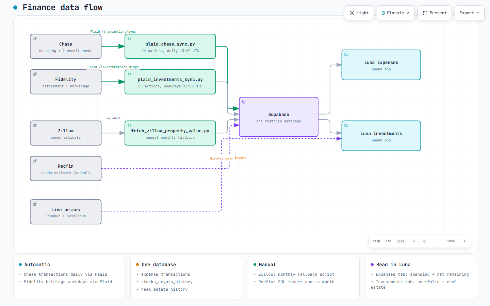

# finances/

Every script that gets money data into Supabase. The Luna Expenses and Investments tabs, and the archived v1 finances dashboard, all read from what these scripts write.

## Flow

[](assets/finance-flow.html)

*Click the image for the interactive version.*

## Files

```
finances/
├── README.md
├── .env.example                          # Template for local .env (never committed)
├── requirements.txt                      # Python deps: plaid-python, supabase, python-dotenv
├── scripts/
│   ├── plaid_chase_link.py               # ONE-TIME: link Chase via Plaid Hosted Link
│   ├── plaid_chase_sync.py               # DAILY: pull Chase transactions -> expense_transactions
│   ├── plaid_investments_link.py         # ONE-TIME: link Fidelity (uses Plaid Investments API)
│   ├── plaid_investments_sync.py         # WEEKDAYS: pull Fidelity holdings -> stocks_crypto_history
│   └── fetch_zillow_property_value.py    # MANUAL FALLBACK: pull Zillow Zestimate -> real_estate_history
└── assets/
    └── finance-flow.{json, html, png}    # Diagram source, viewer, and preview image
```

## What each script does

| Script | When it runs | What it writes |
|--------|--------------|----------------|
| `plaid_chase_sync.py` | GitHub Actions daily 13:00 UTC (`pull-finances.yml`) | `expense_transactions`, `plaid_sync_state`; reads `plaid_accounts` + `category_mapping` |
| `plaid_investments_sync.py` | GitHub Actions weekdays 22:00 UTC (`pull-investments.yml`) | `stocks_crypto_history` (Retirement + Brokerage rows only — Stocks/Crypto rows are untouched) |
| `plaid_chase_link.py` | Manual, once, to authorize Chase | Populates `plaid_accounts` and returns the `PLAID_ACCESS_TOKEN` you paste into GitHub Secrets |
| `plaid_investments_link.py` | Manual, once, to authorize Fidelity | Same, but returns `PLAID_FIDELITY_ACCESS_TOKEN` |
| `fetch_zillow_property_value.py` | Manual, monthly | `real_estate_history` (Zillow row). Luna's Refresh Prices button does this automatically; the script is the fallback |

## Naming convention

- **`plaid_chase_*.py`** uses the Plaid *Transactions* API (for the bank).
- **`plaid_investments_*.py`** uses the Plaid *Investments* API (for Fidelity holdings).
- They aren't parallel-named on purpose — they name the API product being called, which matters when reading Plaid's docs.

## Reruns and backfills

Both syncs are idempotent — `.upsert()` keyed on primary key. Rerunning at any time is safe:

```powershell
python finances\scripts\plaid_chase_sync.py         # from repo root, with .env loaded
python finances\scripts\plaid_investments_sync.py
```

Both prefer `SUPABASE_SERVICE_ROLE_KEY` (bypasses RLS) when present, falling back to `SUPABASE_KEY` (anon). GitHub Actions provides service_role; local runs use whichever is in your `.env`.

## Redfin

Redfin doesn't have a fetchable API from the browser (CORS), and there's no first-party script here. To add a monthly Redfin datapoint, run this in the Supabase SQL editor:

```sql
insert into real_estate_history (snapshot_date, home_value, mortgage_balance, data_source)
values (current_date, <redfin_estimate>, <mortgage_balance>, 'Redfin');
```

Both the Zillow row (from the automated fetcher) and this Redfin row live in the same table; Luna's Investments tab averages them for display.

## See also

- [../docs/tables.md](../docs/tables.md) — full Supabase schema for the finance tables
- [../docs/maintainers.md](../docs/maintainers.md) — GitHub Actions + secrets + RLS
