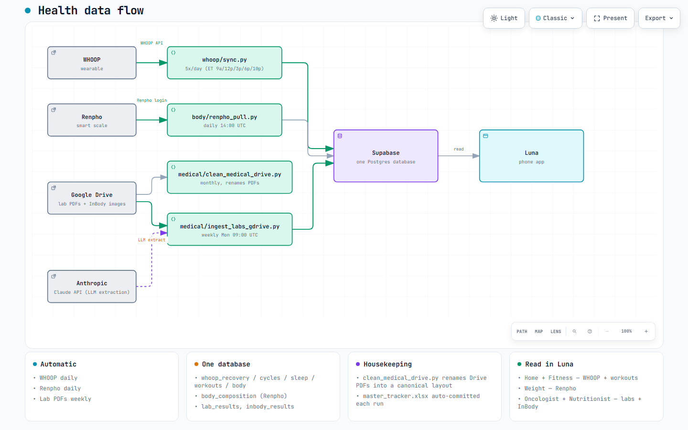

# health/

Every script that pulls health data into Supabase. Three independent pipelines: WHOOP, Renpho, and lab results from Google Drive.

## Flow

[](assets/health-flow.html)

*Click the image for the interactive version.*

## Files

```
health/
├── README.md
├── assets/
│   └── health-flow.{json, html, png}       # Diagram source, viewer, preview
├── whoop/
│   ├── bootstrap.py                        # ONE-TIME: WHOOP OAuth auth-code exchange
│   └── sync.py                             # DAILY: WHOOP wearable -> whoop_* tables
├── body/
│   ├── renpho_pull.py                      # DAILY: Renpho scale -> body_composition
│   └── requirements.txt
└── medical/
    ├── ingest_labs_gdrive.py               # WEEKLY: Google Drive lab PDFs -> lab_results, inbody_results
    ├── clean_medical_drive.py              # MONTHLY: rename Drive PDFs into a canonical layout
    ├── requirements.txt
    └── tracker/
        ├── README.md                       # Explains the algorithm + the _REVISAR bin
        └── master_tracker.xlsx             # Standing inventory, auto-committed each clean run
```

## What each pipeline does

### `whoop/`

| Script | When | Writes |
|--------|------|--------|
| `sync.py` | GitHub Actions 5x/day at 02/13/16/19/22 UTC (≈ 9am/12pm/3pm/6pm/10pm ET) (`whoop-daily-sync.yml`) | `whoop_recovery`, `whoop_cycles`, `whoop_sleep`, `whoop_workouts`, `whoop_body`. Also rotates the `WHOOP_REFRESH_TOKEN` secret via `GH_PAT` |
| `bootstrap.py` | Manual, once, to get the initial refresh token | Prints the tokens; you paste them into GitHub secrets. Not needed once `sync.py` is running because it self-rotates the refresh token |

### `body/`

| Script | When | Writes |
|--------|------|--------|
| `renpho_pull.py` | GitHub Actions daily 14:00 UTC (`pull-body.yml`) | `body_composition` (weight, body fat, muscle, water, bone) |

Requires `RENPHO_EMAIL` + `RENPHO_PASSWORD` (yes, plain-text credentials — Renpho has no OAuth). Stored in GitHub secrets, never in the frontend.

### `medical/`

| Script | When | Writes |
|--------|------|--------|
| `ingest_labs_gdrive.py` | GitHub Actions weekly Mon 09:00 UTC (`medical-ingest-labs.yml`) | `lab_results` (marker, value, unit, ref range, flag, panel — normalized to 11 canonical panels via LLM), `inbody_results` (bioimpedance scan snapshots) |
| `clean_medical_drive.py` | GitHub Actions (`medical-clean-drive.yml`, currently monthly) | Nothing in Supabase. Renames confidently-resolved PDFs into `{year}/{category}/YYYY-MM-DD_<slug>.pdf`. Ambiguous files go to `Medical/_REVISAR` for a human to sort. Also rewrites `tracker/master_tracker.xlsx` and commits it back to the repo |

The ingest uses Anthropic's Claude API (`ANTHROPIC_API_KEY` secret) to extract structured lab values from PDF text. Extracted rows are keyed on `(fecha, marcador, valor)` for idempotent re-runs.

## Secrets required

See [../docs/maintainers.md](../docs/maintainers.md#secrets) for the full list. The health-specific ones:

- **WHOOP:** `WHOOP_CLIENT_ID`, `WHOOP_CLIENT_SECRET`, `WHOOP_REFRESH_TOKEN`
- **Renpho:** `RENPHO_EMAIL`, `RENPHO_PASSWORD`
- **Medical:** `GOOGLE_CREDENTIALS`, `ANTHROPIC_API_KEY`

All three pipelines also need `SUPABASE_URL` + `SUPABASE_SERVICE_ROLE_KEY` (bypasses RLS on the writes).

## Reruns

All three scripts are idempotent — safe to trigger any workflow manually from the Actions tab. Order doesn't matter; each pipeline writes to its own tables.

## See also

- [../docs/tables.md](../docs/tables.md) — full schema for `whoop_*`, `body_composition`, `lab_results`, `inbody_results`
- [../docs/maintainers.md](../docs/maintainers.md) — GitHub Actions + secrets + RLS
- [medical/tracker/README.md](medical/tracker/README.md) — the Drive cleaner's algorithm
