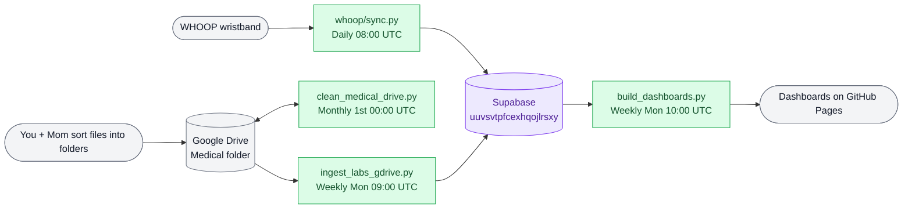

# Medical Dashboards

Automated personal biometric dashboard pipeline. Two provider-facing HTML dashboards rebuild weekly via GitHub Actions and are served live on GitHub Pages.

## How it fits together

Unified pipeline in the personal repo feeding one Supabase database.

**Data flows:**
- **WHOOP row:** WHOOP wristband → `whoop/sync.py` (daily 08:00 UTC) → Supabase
- **Labs/imaging row:** Google Drive medical folder → `clean_medical_drive.py` (monthly cleanup) → `ingest_labs_gdrive.py` (weekly Mon 09:00 UTC) → Supabase → `build_dashboards.py` (weekly Mon 10:00 UTC) → GitHub Pages

**File handling:** You and your mom drop files into Drive, sorted by `{year}/{category}/` folder. `clean_medical_drive.py` runs monthly (1st at midnight UTC), renames confidently-resolved files in place to match their real date/category/provider. Anything unclear gets moved into `Medical/_REVISAR` (prefixed `REVISAR_`) for manual sorting; confirmed duplicates land there too (prefixed `DUP_`). `ingest_labs_gdrive.py` runs weekly (Mon 09:00 UTC), trusting only correctly-named files, and inserts extracted values into Supabase.

Once data lands in Supabase, `build_dashboards.py` runs weekly (Mon 10:00 UTC), rebuilds the two Spanish dashboards, and GitHub Pages serves them.

## Dashboards

| Dashboard | Audience | Language |
|---|---|---|
| `martinez_nutritionist_dashboard.html` | Nutriólogo (Javier) | Spanish |
| `martinez_oncologist_dashboard.html` | Oncóloga (Dra. Escobar) | Spanish |

Live at: `https://fernandomartinez-de.github.io/vital-signal-reports/`

## Automation

| Workflow | Trigger | Does |
|---|---|---|
| `whoop-daily-sync.yml` | Daily 08:00 UTC + manual | Runs `health/whoop/sync.py` to pull WHOOP data. |
| `medical-clean-drive.yml` | Monthly 1st 00:00 UTC + manual | Runs `clean_medical_drive.py` with `--apply`. Manual trigger is dry-run unless you check `apply`. Uploads `rename_log.csv` as an artifact. |
| `medical-ingest-labs.yml` | Weekly Mon 09:00 UTC + manual | Runs `ingest_labs_gdrive.py`. |
| `medical-rebuild-dashboards.yml` | Weekly Mon 10:00 UTC + manual | Runs `build_dashboards.py`, commits the rebuilt dashboards. |

## Stack

| Layer | Tool |
|---|---|
| Wearable sync | WHOOP API via `health/whoop/sync.py` |
| Database | Supabase PostgreSQL (uuvsvtpfcexhqojlrsxy) |
| Lab/imaging source | Google Drive |
| Automation | GitHub Actions |
| Hosting | GitHub Pages |

## Setup

1. Clone the repo, `pip install -r requirements.txt`
2. Add repo secrets: `SUPABASE_DB_URL`, `ANTHROPIC_API_KEY`, `GDRIVE_CREDENTIALS` (service account JSON)
3. Give that service account **Editor** access on the Medical Drive folder — the cleaner needs to rename files and move duplicates/unresolved files into `_REVISAR`
4. Enable GitHub Pages on `main`
5. Everything else runs automatically, including the cleaner's nightly `--apply` run — no manual trigger needed for normal operation

## Notes

Personal health monitoring project. Dashboard content is in Spanish, tailored to specific provider workflows. Data is private.
