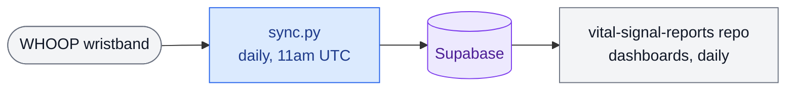

# whoop-pipeline

Automated data pipeline that syncs personal WHOOP wearable metrics into a Supabase PostgreSQL database on a daily schedule via GitHub Actions. Powers the biometric dashboards in [vital-signal-reports](https://github.com/fernandomartinez-de/vital-signal-reports).

## How it fits together

This repo is the top row of a two-repo pipeline; [`vital-signal-reports`](https://github.com/fernandomartinez-de/vital-signal-reports) is the other. Blue = *this* repo, purple = the shared database, gray = the other repo (reads only, never writes here).

`sync.py` authenticates with the WHOOP API (OAuth2, refresh token rotated in GitHub Secrets after every run so it never expires), pulls cycles/recovery/sleep/workouts/body data, and upserts it into Supabase — conflict-safe, so re-running never duplicates rows. `vital-signal-reports` only ever reads from that same database; nothing in this repo talks to it directly.

## Data collected

| Table | Metrics |
|---|---|
| `whoop_cycles` | Strain, average HR, max HR, kilojoules, calories |
| `whoop_recovery` | Recovery score, resting HR, HRV (RMSSD), SpO2, skin temp |
| `whoop_sleep` | Duration, performance %, efficiency %, light/SWS/REM/awake minutes |
| `whoop_workouts` | Sport name, strain, average HR, max HR, kilojoules, calories |
| `whoop_body` | Height, weight, max HR, VO2 max |

## Automation (this repo)

| Workflow | Trigger | Does |
|---|---|---|
| `daily_sync.yml` | Daily, 11am UTC (+ manual) | Runs `sync.py` — pulls the latest WHOOP data and upserts it into Supabase. |
| `bootstrap_token.yml` | Manual, one-shot | Runs `bootstrap.py` to exchange a fresh WHOOP OAuth2 authorization code for the initial refresh token. Only needed once per WHOOP app registration, or if the refresh token is ever lost. |

`vital-signal-reports` has its own workflows in its own repo.

## Files

| File | Purpose |
|---|---|
| `sync.py` | Main sync script: auth, API calls, upsert into Supabase, token rotation |
| `bootstrap.py` | One-time setup: exchanges an OAuth2 authorization code for the initial refresh token |
| `.github/workflows/` | GitHub Actions workflows for the daily sync and the one-shot bootstrap |

## Setup

### First time only (bootstrap)

1. Register a WHOOP app at [developer.whoop.com](https://developer.whoop.com) and get your Client ID and Client Secret
2. Complete the OAuth2 authorization flow to get an authorization code
3. Add `CLIENT_ID`, `CLIENT_SECRET`, and `AUTH_CODE` as GitHub Actions secrets — an authorization code is single-use and short-lived, so don't leave it sitting in a workflow file
4. Run `bootstrap_token.yml` manually once to exchange the auth code for your initial refresh token
5. Add the resulting `WHOOP_REFRESH_TOKEN` as a GitHub Actions secret

### Ongoing (automated)

Add the following secrets to your GitHub repository:

| Secret | Description |
|---|---|
| `WHOOP_CLIENT_ID` | WHOOP app client ID |
| `WHOOP_CLIENT_SECRET` | WHOOP app client secret |
| `WHOOP_REFRESH_TOKEN` | OAuth2 refresh token (auto-rotated after each run) |
| `SUPABASE_DB_URL` | Supabase PostgreSQL connection string |
| `GH_PAT` | GitHub Personal Access Token with `secrets:write` scope for token rotation |

`daily_sync.yml` handles all subsequent runs automatically. The refresh token rotates itself after every sync so it never goes stale.

## Notes

Personal health data pipeline. All data is private and flows exclusively into a personal Supabase instance also used by `vital-signal-reports`. No data is shared or exposed publicly.
