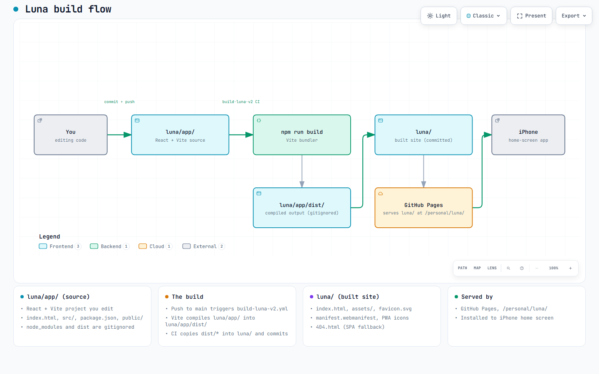

# luna/

Everything the Luna v2 app is made of, plus the built site GitHub Pages serves. Source and output live side by side.

## Flow

[](../docs/assets/luna-build.html)

*Click the image for the interactive version.*

## What's here

```
luna/
├── README.md                    # this file
├── app/                         # SOURCE — you edit here
│   ├── index.html               # Vite entry point
│   ├── package.json             # deps + build scripts
│   ├── vite.config.js           # base: '/personal/luna/'
│   ├── src/                     # React components + pages
│   ├── public/                  # static assets copied verbatim to build
│   ├── supabase/                # one-off SQL setup files
│   └── (node_modules/, dist/ — gitignored)
│
└── (built output — DO NOT EDIT DIRECTLY, CI regenerates)
    ├── index.html               # bundled entry
    ├── 404.html                 # SPA fallback (copy of index.html)
    ├── assets/                  # bundled JS + CSS
    ├── favicon.svg
    ├── manifest.webmanifest     # PWA manifest
    ├── apple-touch-icon.png     # iOS home-screen icon
    ├── icon-192.png, icon-512.png
    └── medical/                 # legacy provider-facing static pages
```

## The rule

- **Edit in `luna/app/`.** Commit + push.
- **Never edit the built output at `luna/`'s root by hand.** Every push to `luna/app/**` triggers `build-luna-v2.yml`, which reruns Vite and overwrites the built files. Manual edits get clobbered on the next build.

## Local dev

```powershell
cd luna\app
npm install
npm run dev        # http://localhost:5173
```

Hot-reload on the source; no build step needed for dev.

## Build workflow

`.github/workflows/build-luna-v2.yml` handles the whole pipeline:

1. Triggers on any push to `luna/app/**` on `main`
2. Installs deps (`npm ci`), runs `npm run build` in `luna/app/`
3. Vite emits `luna/app/dist/`
4. CI copies `luna/app/dist/*` up into `luna/`
5. CI adds `luna/404.html` = a copy of `luna/index.html` (SPA fallback)
6. `luna-bot` commits and pushes the built files

The step 6 commit only touches files under `luna/` **excluding** `luna/app/**`, so source edits and build output never fight over the same commit.

## Deployed

GitHub Pages serves the whole repo root at `fernandomartinez-de.github.io/personal/`. The Luna app is at `/personal/luna/`. The site's root `/personal/index.html` auto-redirects there.

Root `/personal/404.html` (in the repo root, not this folder) is the SPA fallback for any missing URL under `/personal/luna/` — it stashes the intended path in sessionStorage and redirects to the app shell, which restores the route before React Router boots.

## See also

- [../README.md](../README.md) — top-level project README
- [../docs/maintainers.md](../docs/maintainers.md) — dev setup, secrets, RLS
- [app/README.md](app/README.md) — the app's own README (features, screens)
