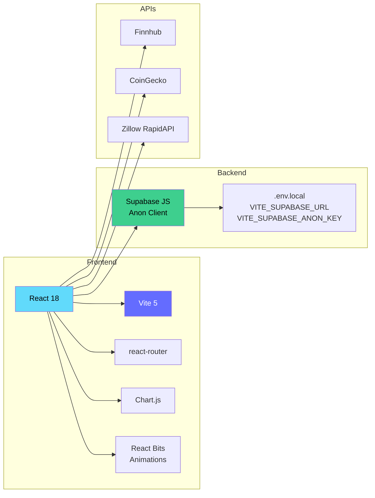

# Luna v2 (Exercise App)

React 18 + Vite 5 personal dashboard app integrating fitness tracking, nutrition, finances, and medical data. All data flows through a single unified Supabase database (uuvsvtpfcexhqojlrsxy).

## Overview

**Pages:** Home, Hub, Exercises (list + detail), Workouts (list + detail), Programs, Weight, Food, Finances (Expenses + Investments tabs), Medical (Oncologist + Nutritionist views).

**Notable features:**
- Finances → Investments has a manual **Refresh Prices** button that writes a fresh snapshot to `stocks_crypto_history` (Finnhub stocks, CoinGecko crypto, Zillow via RapidAPI for property)
- Medical page embeds the same provider dashboards as the v1 medical wrapper
- Exercise detail pages show anatomical muscle diagrams using [`react-body-highlighter`](https://github.com/giavinh79/react-body-highlighter) 2.0.5
- Reads/writes Supabase via the anon client using `VITE_*` env vars from `.env.local` (gitignored)

## Architecture

### Complete System Architecture

```mermaid
graph TB
    subgraph "External APIs"
        FINNHUB[Finnhub API<br/>Stock Prices]
        COINGECKO[CoinGecko API<br/>Crypto Prices]
        ZILLOW[Zillow via RapidAPI<br/>Property Values]
    end

    subgraph "Luna v2 React App<br/>(Local: npm run dev)"
        ROUTER[React Router]

        subgraph "Pages"
            HOME[Home<br/>Landing]
            HUB[Hub<br/>Dashboard]
            EX_LIST[Exercises<br/>List + Detail]
            WO_LIST[Workouts<br/>List + Detail]
            PROGRAMS[Programs]
            WEIGHT[Weight]
            FOOD[Food]
            FIN[Finances<br/>Expenses + Investments tabs]
            MED[Medical<br/>Oncologist + Nutritionist]
        end

        REFRESH[Refresh Prices Button<br/>Manual Trigger]
        SUPABASE_CLIENT[Supabase JS Client<br/>Anon Key]
    end

    subgraph "Supabase Database<br/>(uuvsvtpfcexhqojlrsxy)"
        subgraph "Finance Tables"
            EXPENSE[expense_transactions]
            STOCKS[stocks_crypto_history]
            REAL_ESTATE[real_estate_history]
        end

        subgraph "Health Tables"
            WHOOP[whoop_recovery<br/>whoop_cycles<br/>whoop_sleep]
            BODY[body_composition]
            NUTRITION[nutrition_log]
            LABS[labs]
        end

        subgraph "v2 App Tables"
            EXERCISES[exercises]
            WORKOUTS[workouts<br/>workout_exercises]
            COMPLETED[completed_workouts<br/>completed_workout_exercises]
        end
    end

    subgraph "GitHub Actions Pipelines"
        PLAID[plaid_chase_sync.py<br/>Daily 13:00 UTC]
        PLAID_INV[plaid_investments_sync.py<br/>Weekdays 22:00 UTC]
        WHOOP_SYNC[whoop/sync.py<br/>Daily 08:00 UTC]
        BODY_SYNC[renpho_pull.py<br/>Daily 14:00 UTC]
        LABS_SYNC[ingest_labs_gdrive.py<br/>Weekly Mon 09:00 UTC]
    end

    ROUTER --> HOME
    ROUTER --> HUB
    ROUTER --> EX_LIST
    ROUTER --> WO_LIST
    ROUTER --> PROGRAMS
    ROUTER --> WEIGHT
    ROUTER --> FOOD
    ROUTER --> FIN
    ROUTER --> MED

    FIN --> SUPABASE_CLIENT
    EX_LIST --> SUPABASE_CLIENT
    WO_LIST --> SUPABASE_CLIENT
    WEIGHT --> SUPABASE_CLIENT
    FOOD --> SUPABASE_CLIENT
    MED --> SUPABASE_CLIENT
    HUB --> SUPABASE_CLIENT

    SUPABASE_CLIENT -->|Read| EXPENSE
    SUPABASE_CLIENT -->|Read| STOCKS
    SUPABASE_CLIENT -->|Read| REAL_ESTATE
    SUPABASE_CLIENT -->|Read| WHOOP
    SUPABASE_CLIENT -->|Read| BODY
    SUPABASE_CLIENT -->|Read| NUTRITION
    SUPABASE_CLIENT -->|Read| LABS
    SUPABASE_CLIENT -->|Read/Write| EXERCISES
    SUPABASE_CLIENT -->|Read/Write| WORKOUTS
    SUPABASE_CLIENT -->|Read/Write| COMPLETED

    FIN --> REFRESH
    REFRESH --> FINNHUB
    REFRESH --> COINGECKO
    REFRESH --> ZILLOW
    FINNHUB --> STOCKS
    COINGECKO --> STOCKS
    ZILLOW --> REAL_ESTATE

    PLAID --> EXPENSE
    PLAID_INV --> STOCKS
    WHOOP_SYNC --> WHOOP
    BODY_SYNC --> BODY
    LABS_SYNC --> LABS

    style HOME fill:#10b981,color:#fff
    style HUB fill:#10b981,color:#fff
    style FIN fill:#3b82f6,color:#fff
    style MED fill:#ef4444,color:#fff
    style REFRESH fill:#f59e0b,color:#000
    style SUPABASE_CLIENT fill:#8b5cf6,color:#fff
```



### Tech Stack



### Page Structure

```mermaid
graph TB
    ROOT[/]

    ROOT --> HOME[/home<br/>Landing Page]
    ROOT --> HUB[/hub<br/>Dashboard Hub]
    ROOT --> EXERCISES[/exercises<br/>Exercise Library]
    ROOT --> EX_DETAIL[/exercises/:id<br/>Exercise Detail]
    ROOT --> WORKOUTS[/workouts<br/>Workout Templates]
    ROOT --> WO_DETAIL[/workouts/:id<br/>Workout Detail]
    ROOT --> PROGRAMS[/programs<br/>Training Programs]
    ROOT --> WEIGHT[/weight<br/>Body Weight Tracking]
    ROOT --> FOOD[/food<br/>Nutrition Log]
    ROOT --> FINANCES[/finances<br/>Expenses + Investments]
    ROOT --> MEDICAL[/medical<br/>Oncologist + Nutritionist]

    EXERCISES --> EX_DETAIL
    WORKOUTS --> WO_DETAIL

    style HOME fill:#10b981,color:#fff
    style HUB fill:#10b981,color:#fff
    style FINANCES fill:#3b82f6,color:#fff
    style MEDICAL fill:#ef4444,color:#fff
```

## Prerequisites

- Node.js 18+
- npm

## Setup

```powershell
cd C:\Users\fmartine\Personal\repos\personal\luna\app
npm install
```

Credentials are already in `.env` for this project. If you want to point at a different Supabase project, edit `.env`:

```
VITE_SUPABASE_URL=https://your-project.supabase.co
VITE_SUPABASE_ANON_KEY=<anon-key>
```

## Run

```powershell
npm run dev
```

The dev server opens on http://localhost:5173.

## Build

```powershell
npm run build
npm run preview
```

## What it does

**Exercises:**
- Loads ~876 exercises from `exercises` table in pages of 1000, sorted by `name`
- Filter chips restrict by `muscle_group` (10 groups: chest, back, shoulders, biceps, triceps, quadriceps, hamstrings, glutes, calves, core)
- Free-text search on `name`
- Click a card → `/exercise/:id` shows two movement images, instructions, equipment/category/level, and anterior + posterior muscle diagrams with primary + secondary muscles highlighted

**Workouts:**
- Browse workout templates from `workouts` table
- View workout detail with exercise list
- Track completed workouts in `completed_workouts`

**Finances:**
- **Expenses tab:** View categorized transactions from `expense_transactions` (auto-synced daily from Chase via Plaid)
- **Investments tab:** View stock/crypto portfolio from `stocks_crypto_history` + property values from `real_estate_history`
- **Refresh Prices button:** Manually fetch live prices from Finnhub (stocks), CoinGecko (crypto), and Zillow (property) and write fresh snapshot to database

**Medical:**
- Embeds Oncologist dashboard (`martinez_oncologist_dashboard.html`)
- Embeds Nutritionist dashboard (`martinez_nutritionist_dashboard.html`)
- Both read from `labs` table (auto-synced weekly from Google Drive PDFs)

**Weight:**
- Body composition tracking from `body_composition` (auto-synced daily from Renpho scale)

**Food:**
- Nutrition log from `nutrition_log`

## Muscle mapping

Table `muscle_group` (and `secondary_muscles[]`) values are mapped to `react-body-highlighter` muscle keys in [`src/utils/muscleMapping.js`](src/utils/muscleMapping.js):

| DB value    | Highlighter muscles         |
|-------------|-----------------------------|
| chest       | chest                       |
| back        | upper-back, lower-back      |
| shoulders   | front-deltoids, back-deltoids (`react-body-highlighter` does not have a `shoulders` key) |
| biceps      | biceps                      |
| triceps     | triceps                     |
| quadriceps  | quadriceps                  |
| hamstrings  | hamstring                   |
| glutes      | gluteal                     |
| calves      | calves                      |
| core        | abs, obliques               |

If you add new `muscle_group` or `secondary_muscles` values in Supabase, extend `MUSCLE_TO_HIGHLIGHTER` in the same file.

## Layout

```
luna/app/
├── index.html
├── package.json
├── vite.config.js
├── .env.local                    # Gitignored (VITE_SUPABASE_URL, VITE_SUPABASE_ANON_KEY)
├── .env.example
├── public/
│   └── medical/                  # Embedded medical dashboards
│       ├── martinez_oncologist_dashboard.html
│       └── martinez_nutritionist_dashboard.html
├── supabase/
│   ├── create_workouts.sql
│   └── create_workout_logs.sql
├── src/
│   ├── main.jsx
│   ├── App.jsx / App.css
│   ├── index.css
│   ├── supabaseClient.js
│   ├── components/
│   │   ├── BodyDiagram.jsx
│   │   ├── ExerciseCard.jsx
│   │   ├── MuscleFilter.jsx
│   │   └── [other components]
│   ├── pages/
│   │   ├── HomePage.jsx          # Landing page
│   │   ├── HubPage.jsx           # Dashboard hub
│   │   ├── ExerciseListPage.jsx  # Exercise library
│   │   ├── ExerciseDetailPage.jsx
│   │   ├── WorkoutsPage.jsx      # Workout templates
│   │   ├── WorkoutDetailPage.jsx
│   │   ├── ProgramsPage.jsx      # Training programs
│   │   ├── WeightPage.jsx        # Body weight tracking
│   │   ├── FoodPage.jsx          # Nutrition log
│   │   ├── FinancesPage.jsx      # Expenses + Investments
│   │   └── MedicalPage.jsx       # Oncologist + Nutritionist
│   └── utils/
│       └── muscleMapping.js
```
