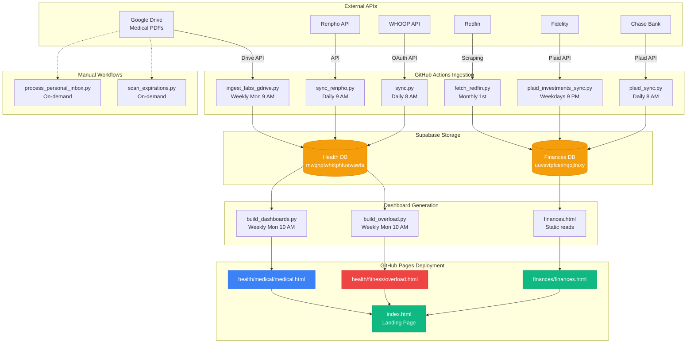

# Workflows

Complete automation workflows for personal dashboards and data pipelines. All workflows run automatically via GitHub Actions or on-demand locally.

## Live Dashboards

**🌐 Landing Page:** https://fernandomartinez-de.github.io/personal/

Three main dashboards with automatic weekly/daily updates:
- **💰 Finances** - Net worth, expenses, investments, property values
- **💪 Fitness (Overload)** - Training plans, WHOOP data, nutrition tracking
- **🏥 Medical** - Oncologist & Nutritionist lab dashboards

---

## Active Workflows

### 💰 Finances Pipeline
**[finances/finances-automation.md](finances/finances-automation.md)**

Real-time financial tracking with daily automated updates:
- **Daily:** Chase transactions via Plaid → expense_transactions
- **Weekdays:** Fidelity investments via Plaid → stocks_crypto_history
- **Monthly:** Redfin property values → real_estate_history
- **Manual:** Statement filing for backfill

**Repository:** `personal/finances/`  
**Database:** Supabase (uuvsvtpfcexhqojlrsxy)  
**Tables:** expense_transactions, stocks_crypto_history, real_estate_history, category_mapping  
**Dashboard:** finances.html (static, reads from Supabase)  
**Schedules:**
- pull-finances.yml → Daily 8 AM UTC
- pull-investments.yml → Weekdays 9 PM UTC (⏳ pending Investments product)
- redfin-property-sync.yml → Monthly 1st, 1 AM UTC

---

### 💪 Fitness Pipeline (Overload)
**[health/fitness-automation.md](health/fitness-automation.md)**

Comprehensive fitness and nutrition tracking:
- **Daily:** WHOOP data sync (recovery, sleep, workouts, cycles)
- **Daily:** Renpho body composition sync
- **Weekly:** Dashboard rebuild with latest data
- **Manual:** Nutrition log entry, strength training entry

**Repository:** `personal/health/fitness/`  
**Database:** Supabase (mwqnplwhktphfuewswfa)  
**Tables:** whoop_recovery, whoop_cycles, whoop_sleep, whoop_workouts, body_composition, nutrition_log, strength_sessions, strength_exercises, strength_sets  
**Dashboard:** overload.html (generated weekly from template)  
**Schedules:**
- whoop-daily-sync.yml → Daily 8 AM UTC
- whoop-bootstrap-token.yml → Weekly Sun midnight
- pull-body.yml → Daily 9 AM UTC
- build-fitness.yml → Weekly Mon 10 AM UTC

---

### 🏥 Medical Pipeline
**[health/medical-automation.md](health/medical-automation.md)**

Automated medical lab tracking with provider dashboards:
- **Weekly:** Google Drive lab PDF ingestion
- **Weekly:** Dashboard generation (Oncologist & Nutritionist views)
- **Monthly:** Drive cleanup (processed PDFs)

**Repository:** `personal/health/medical/`  
**Database:** Supabase (mwqnplwhktphfuewswfa)  
**Tables:** labs  
**Dashboards:**
- medical.html (wrapper with tabs)
- martinez_oncologist_dashboard.html (auto-generated)
- martinez_nutritionist_dashboard.html (auto-generated)

**Schedules:**
- medical-ingest-labs.yml → Weekly Mon 9 AM UTC
- medical-rebuild-dashboards.yml → Weekly Mon 10 AM UTC
- medical-clean-drive.yml → Monthly 1st midnight UTC

---

### 📄 Personal Documents
**[docs/docs-automation.md](docs/docs-automation.md)**

Personal document classification, filing, and expiration tracking:
- **Manual:** Inbox processing with pattern matching
- **Manual:** Expiration date scanning across all documents

**Repository:** `personal/docs/`  
**Storage:** Google Drive organized by category  
**Vault Logs:** processing-log.md, expiration-report.md  
**Categories:** Tax, ID, Employment, Medical, Property, Insurance, Education  

---

### ✈️ Travel Sites
**[travel/travel-automation.md](travel/travel-automation.md)**

Static HTML trip planning sites with real-time updates:
- **Manual:** Trip site creation from template
- **Real-time:** Supabase-backed collaborative planning

**Repository:** `personal/travel/`  
**Current trips:** Japan (November 2026)  
**Deployment:** GitHub Pages  

---

## Workflow Status Dashboard

| Workflow | Schedule | Status | Last Update |
|----------|----------|--------|-------------|
| **Finances** |
| Chase Transactions | Daily 8 AM UTC | ✅ Active | Auto via plaid_sync.py |
| Fidelity Investments | Weekdays 9 PM UTC | ⏳ Pending | Awaiting Investments product |
| Redfin Property Sync | Monthly 1st 1 AM | ✅ Active | Auto via fetch_redfin.py |
| **Fitness** |
| WHOOP Daily Sync | Daily 8 AM UTC | ✅ Active | Auto via sync.py |
| WHOOP Token Refresh | Weekly Sun midnight | ✅ Active | Auto via bootstrap.py |
| Renpho Body Sync | Daily 9 AM UTC | ✅ Active | Auto via sync_renpho.py |
| Fitness Dashboard Build | Weekly Mon 10 AM | ✅ Active | Auto via build_overload.py |
| **Medical** |
| Lab PDF Ingestion | Weekly Mon 9 AM | ✅ Active | Auto via ingest_labs_gdrive.py |
| Dashboard Rebuild | Weekly Mon 10 AM | ✅ Active | Auto via build_dashboards.py |
| Drive Cleanup | Monthly 1st midnight | ✅ Active | Auto via clean_medical_drive.py |
| **Documents** |
| Personal Docs Filing | Manual | ✅ Active | On-demand via PROCESS_INBOX.bat |
| Expiration Scanner | Manual | ✅ Active | On-demand via SCAN_EXPIRATIONS.bat |
| **Travel** |
| Trip Site Creation | Manual | ✅ Active | On-demand |

---

## Repository Map

### personal/ (this repo)
```
personal/
├── .github/workflows/                    # GitHub Actions automation
│   ├── pull-finances.yml                 # Daily Chase sync
│   ├── pull-investments.yml              # Weekdays Fidelity sync
│   ├── redfin-property-sync.yml          # Monthly property values
│   ├── whoop-daily-sync.yml              # Daily WHOOP data
│   ├── whoop-bootstrap-token.yml         # Weekly token refresh
│   ├── pull-body.yml                     # Daily Renpho sync
│   ├── build-fitness.yml                 # Weekly Overload rebuild
│   ├── medical-ingest-labs.yml           # Weekly lab ingestion
│   ├── medical-rebuild-dashboards.yml    # Weekly medical rebuild
│   └── medical-clean-drive.yml           # Monthly Drive cleanup
│
├── index.html                            # Landing page (3 dashboard cards)
├── manifest.json                         # PWA manifest
├── sw.js                                 # Service worker (cache: personal-v2)
├── assets/                               # Icons and static assets
│
├── finances/                             # Finance Dashboard
│   ├── finances.html                     # Dashboard (static Supabase reads)
│   └── scripts/
│       ├── plaid_link.py                 # One-time Chase connection
│       ├── plaid_sync.py                 # Daily transaction pull
│       ├── plaid_investments_link.py     # One-time Fidelity connection
│       ├── plaid_investments_sync.py     # Daily holdings pull
│       ├── fetch_redfin_property_value.py  # Monthly property sync
│       ├── load_bronze.py                # Raw data processing
│       └── process_finances_inbox.py     # Manual statement processing
│
├── health/
│   ├── fitness/                          # Fitness Dashboard (Overload)
│   │   ├── overload.html                 # Generated dashboard
│   │   ├── build_overload.py             # Weekly build script
│   │   └── template.html                 # Dashboard template
│   │
│   ├── medical/                          # Medical Dashboards
│   │   ├── medical.html                  # Tab wrapper (Oncologist/Nutritionist)
│   │   ├── martinez_oncologist_dashboard.html      # Auto-generated weekly
│   │   ├── martinez_nutritionist_dashboard.html    # Auto-generated weekly
│   │   ├── build_dashboards.py           # Dashboard generator
│   │   ├── ingest_labs_gdrive.py         # Google Drive PDF → Supabase
│   │   └── clean_medical_drive.py        # Monthly processed file cleanup
│   │
│   ├── whoop/                            # WHOOP Data Sync
│   │   ├── sync.py                       # Daily sync to Supabase
│   │   └── bootstrap.py                  # Token refresh + initial setup
│   │
│   └── body/                             # Body Composition
│       └── sync_renpho.py                # Daily Renpho → Supabase
│
├── docs/                                 # Document Automation
│   ├── process_personal_inbox.py         # Auto-file documents to Drive
│   ├── scan_expirations.py               # Scan for expired documents
│   ├── PROCESS_INBOX.bat                 # Windows launcher
│   └── SCAN_EXPIRATIONS.bat              # Windows launcher
│
├── travel/                               # Trip Planning
│   ├── index.html                        # Trip index
│   └── japan/                            # Japan trip (Nov 2026)
│
└── vault/                                # Obsidian Vault (gitignored, local)
    ├── workflows/                        # Workflow documentation
    │   ├── README.md                     # This file
    │   ├── finances/
    │   ├── health/
    │   ├── docs/
    │   └── travel/
    ├── ops/                              # Operational notes
    │   ├── incoming/                     # Inbox items
    │   ├── outstanding/                  # Pending tasks
    │   └── outgoing/                     # Completed items
    └── outputs/                          # Processing logs
        ├── finances-processing-log.md
        ├── personal-docs-processing-log.md
        └── expiration-report.md
```

---

## Data Flow Diagram



---

## Data Storage

### Supabase Databases

**Finances (uuvsvtpfcexhqojlrsxy.supabase.co):**
- `expense_transactions` - Chase transactions with categories
- `stocks_crypto_history` - Fidelity investment holdings (daily)
- `real_estate_history` - Property value estimates (monthly)
- `category_mapping` - Expense categorization rules

**Health (mwqnplwhktphfuewswfa.supabase.co):**
- `whoop_recovery` - Daily recovery scores, HRV, resting HR
- `whoop_cycles` - 24-48hr physiological cycles
- `whoop_sleep` - Sleep sessions with stage breakdown
- `whoop_workouts` - Workout sessions with HR zones
- `body_composition` - Renpho scale measurements
- `nutrition_log` - Daily nutrition intake
- `strength_sessions` - Training sessions
- `strength_exercises` - Exercise library
- `strength_sets` - Set-by-set training data
- `labs` - Medical lab results from PDFs

### Google Drive

**Medical/** - Lab PDFs, radiology, ultrasounds by year  
**Finances/** - Bill statements by vendor and year  
**Tax/** - W2s, 1098s, 1099s, returns  
**Employment/** - Offer letters, benefits, TN visas  
**ID/** - Passports, visas, licenses by country  
**Insurance/** - Policy declarations  
**Property/** - Purchase docs, mortgage, HOA  
**Education/** - Transcripts, degrees  

---

## Secrets Management

All secrets stored as **GitHub Repository Secrets** (Settings → Secrets → Actions).

### Plaid
- `PLAID_CLIENT_ID` - Plaid app client ID
- `PLAID_SECRET` - Plaid app secret
- `PLAID_ACCESS_TOKEN` - Chase connection token
- `PLAID_FIDELITY_ACCESS_TOKEN` - Fidelity connection token
- `PLAID_FIDELITY_ITEM_ID` - Fidelity item ID

### Supabase
- `SUPABASE_URL` - Finances project URL
- `SUPABASE_KEY` - Finances anon/service key
- `SUPABASE_URL_HEALTH` - Health project URL
- `SUPABASE_KEY_HEALTH` - Health anon/service key

### WHOOP
- `WHOOP_CLIENT_ID` - WHOOP OAuth app ID
- `WHOOP_CLIENT_SECRET` - WHOOP OAuth secret
- `WHOOP_REFRESH_TOKEN` - Refresh token (auto-updated weekly)

### Google
- `GOOGLE_CREDENTIALS` - Service account JSON

### GitHub
- `GH_PAT` - Personal access token (for updating secrets)

---

## Execution Methods

### Automated (GitHub Actions)
**Frequency:** Daily, Weekly, Monthly  
**Runner:** ubuntu-latest  
**Logs:** GitHub Actions tab in repo  
**Notifications:** Email on failure

### Manual (Local)
**Personal docs:** On-demand via batch file  
**Expiration scan:** On-demand via batch file  
**One-time setups:** Plaid/WHOOP connection scripts  

---

## Monitoring & Troubleshooting

### GitHub Actions Status
Check: https://github.com/fernandomartinez-de/personal/actions

**Green checkmark:** Workflow succeeded  
**Red X:** Workflow failed → check logs  
**Yellow dot:** Workflow running  

### Dashboard Not Updating
1. Check GitHub Actions for workflow failures
2. Verify secrets are current (especially WHOOP_REFRESH_TOKEN)
3. Check Supabase for data
4. Hard refresh browser: `Ctrl + Shift + R`

### Supabase Data Validation
**Finances:** https://supabase.com/dashboard/project/uuvsvtpfcexhqojlrsxy  
**Health:** https://supabase.com/dashboard/project/mwqnplwhktphfuewswfa  

Check table row counts and recent timestamps.

### Plaid Connection Issues
Run link scripts to reconnect:
```powershell
cd finances
python scripts\plaid_link.py              # Chase
python scripts\plaid_investments_link.py  # Fidelity
```

### WHOOP Token Expired
```powershell
cd health\whoop
python bootstrap.py
```

---

## Vault Integration

Each workflow cross-references vault knowledge:

**Health workflows →**
- [[health/thyroid-cancer]]
- [[health/surveillance-schedule]]
- [[health/providers]]
- [[health/insurance]]

**Personal workflows →**
- [[identity/visas]]
- [[identity/licenses]]
- [[life-admin/taxes]]
- [[life-admin/employment]]

**Finance workflows →**
- [[life-admin/expenses]]
- [[life-admin/credit-banking]]
- [[life-admin/real-estate]]

---

## For Agents

### Building or Debugging Automation
1. Read relevant workflow note (finances, health, docs)
2. Each note is self-contained with data flow, scripts, tables
3. Check [[workflows/scripts/README]] for script docs
4. Verify secrets in GitHub repo settings

### Adding New Automation
1. Choose domain: finances, health, docs, travel
2. Add scripts to appropriate folder
3. Document in domain's workflow note
4. Add GitHub Actions workflow if scheduled
5. Update this README with workflow status

### Troubleshooting Failures
- Check GitHub Actions logs
- Review "Failure Modes" in workflow note
- Verify secrets current
- Check Supabase data
- Ensure Google Drive accessible

---

## Quick Links

- 🌐 [Live Dashboards](https://fernandomartinez-de.github.io/personal/)
- 🐙 [GitHub Repository](https://github.com/fernandomartinez-de/personal)
- 📊 [Supabase Finances](https://supabase.com/dashboard/project/uuvsvtpfcexhqojlrsxy)
- 📊 [Supabase Health](https://supabase.com/dashboard/project/mwqnplwhktphfuewswfa)
- 🔑 [GitHub Secrets](https://github.com/fernandomartinez-de/personal/settings/secrets/actions)
- 📋 [Plaid Dashboard](https://dashboard.plaid.com/)
- 💾 [Google Drive](https://drive.google.com/drive/my-drive)

---

## Change Log

**2026-09-26:**
- ✅ Consolidated landing page with 3 dashboard cards
- ✅ Moved finances.html to finances/ folder
- ✅ Moved medical.html to health/medical/ folder
- ✅ Renamed fitness index.html → overload.html
- ✅ Added back buttons to all dashboards
- ✅ Fixed medical dashboard iframe paths
- ✅ Reorganized icon assets to assets/ folder
- ✅ Updated service worker cache version to personal-v2
- 🔄 Pending: Fidelity Investments product approval from Plaid
